## AWS-Nginx-Proxy

#### IAM account

First, your admin need to generate an IAM account, add you to a group with enough priviledge.  
Then you can go to the login page of your admin (ask him for the <adminId>):

    https://<adminId>.signin.aws.amazon.com/console/

Connect to that page and give your user/password. You will then be connected to AWS dashboard.

#### EC2

EC2 is the AWS VM solution. 

- **Go to EC2.**
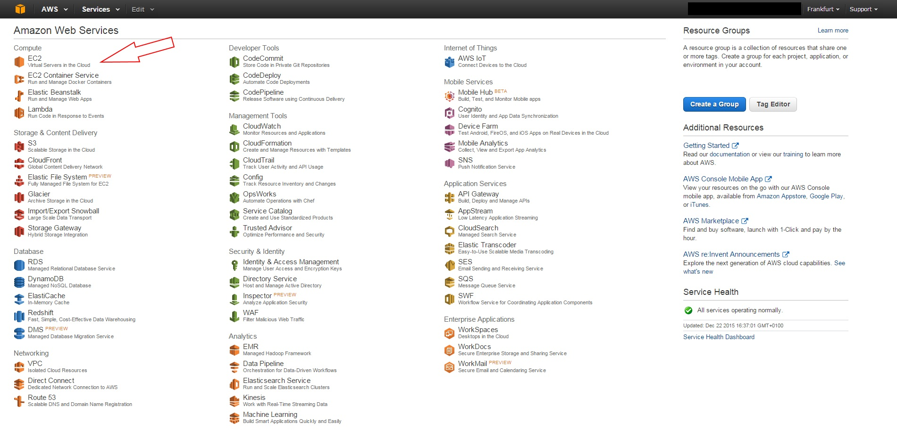

- **Select your zone**
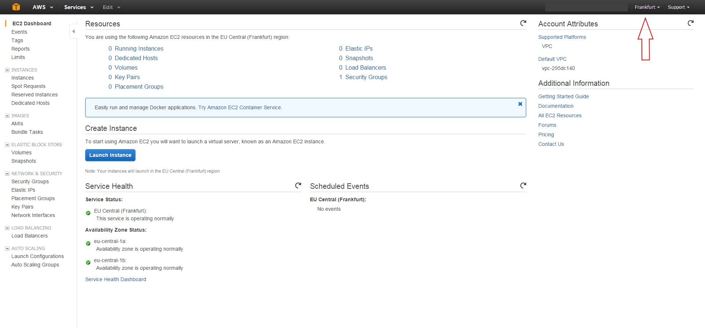

- **Create new instance**
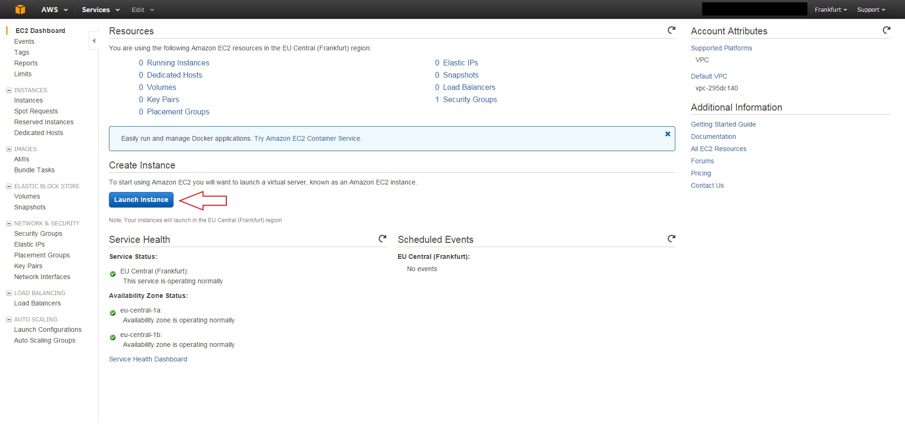

- **Select your OS**
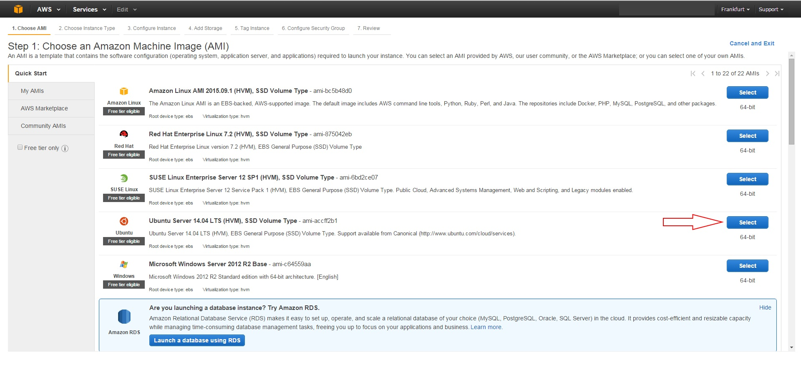

- **Select your machine performances**
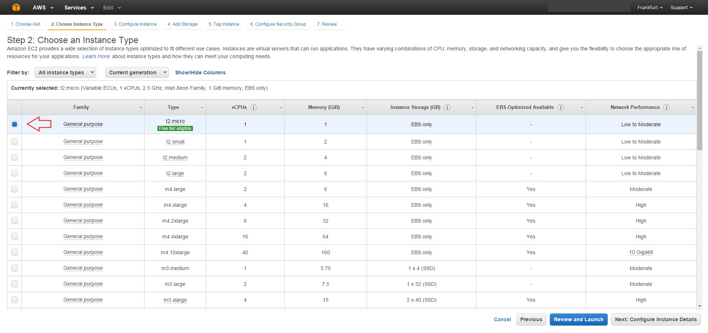

- **Select your machine performances**
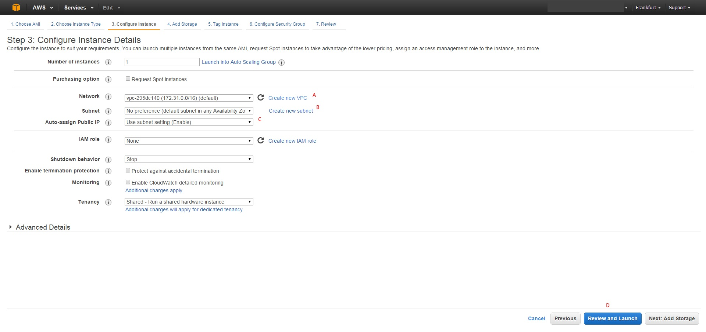

  - A: select/create VPC
  - B: select/create subnet
  - C: enable auto-assign Public IP
  - D: Click `Review and Launch`

- **select/create key-pair**
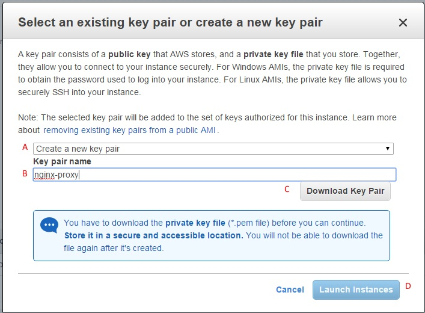

  - A: select/create key/pair
  - B: select or give a name
  - C: download it
  - D: Start the instance

- **Go to your instance**
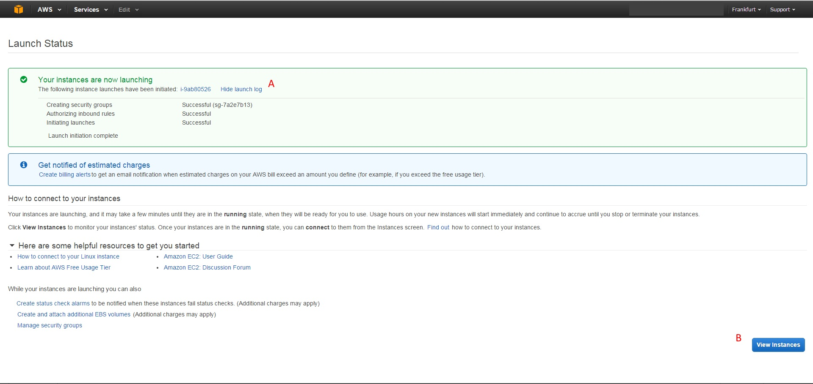

  - A: monitor creation
  - B: go to the instance

- **Get your Public-IP and connect with ssh**
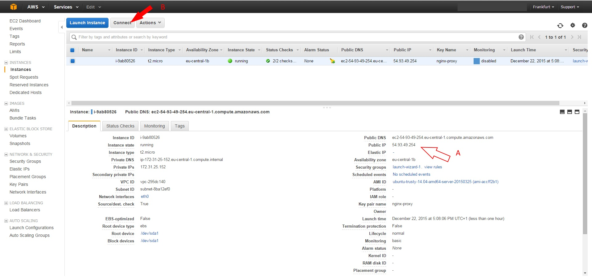

  - A: get Public IP
  - B: connect via ssh by following the instructions
  
#### Setup nginx

run that command:

```bash
file="/tmp/install.sh"
curl https://raw.githubusercontent.com/tdeheurles/docs/master/aws/nginx-proxy/install-nginx.sh \
  > $file         && \
  chmod 755 $file && \
  bash $file
```

#### Control installation

From inside the VM (ssh):

```bash
curl localhost
```
You should have a `Hello` response

From outside the VM:

#### Open Firewall

- **Go to AWS dashboard and open VPC**
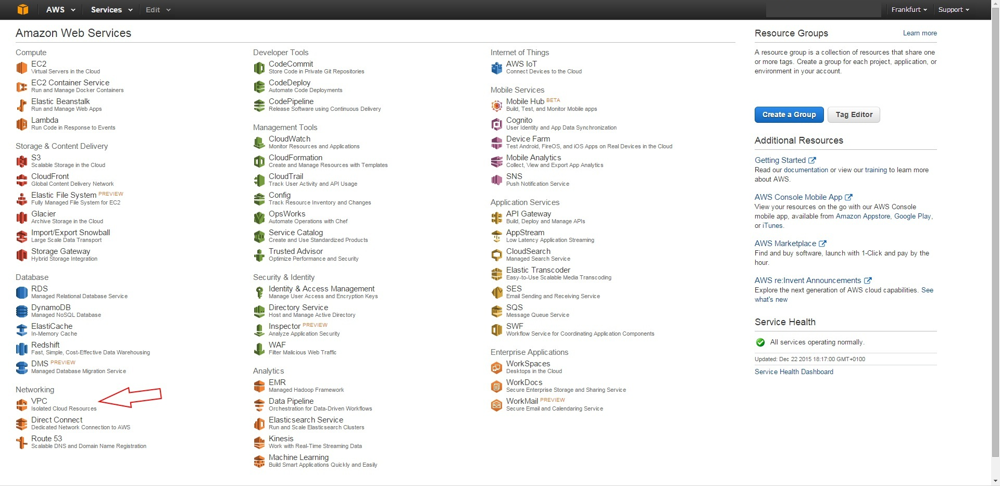

- **Go to security group**
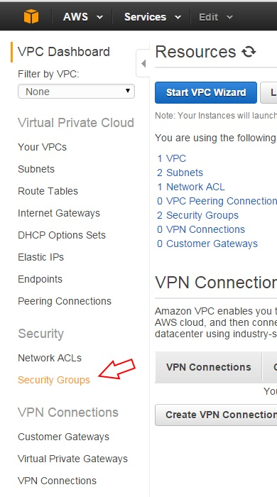

- **Go to security group**


```bash
publicIp="???.???.???.???"
curl $publicIp
```
