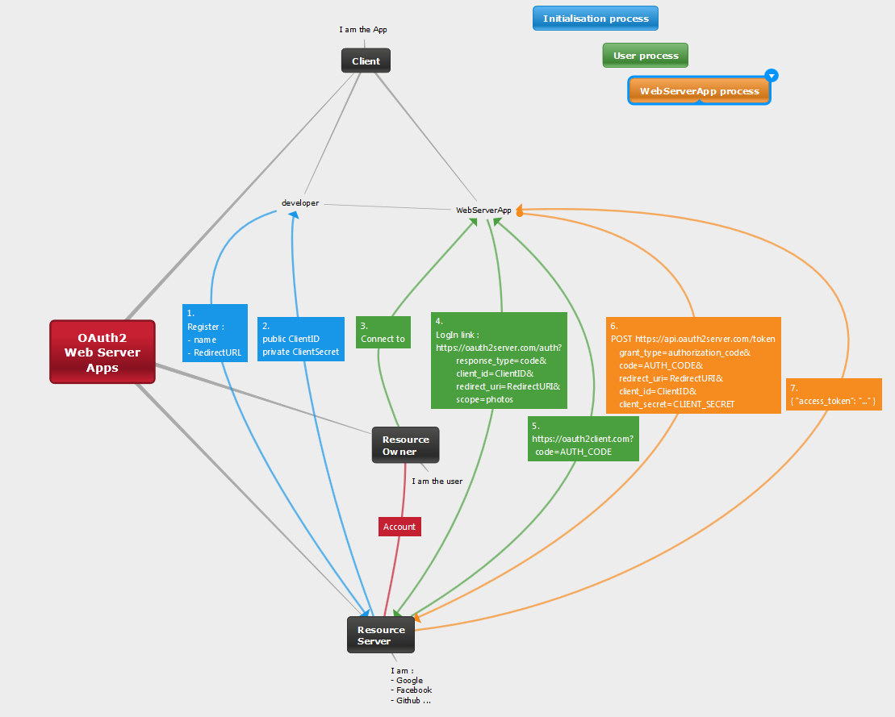
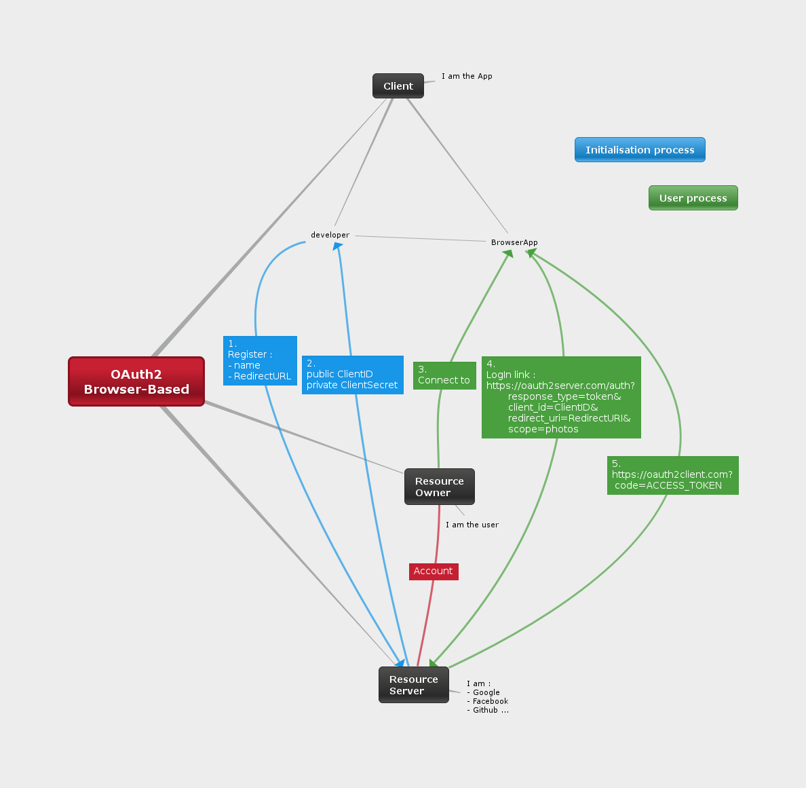
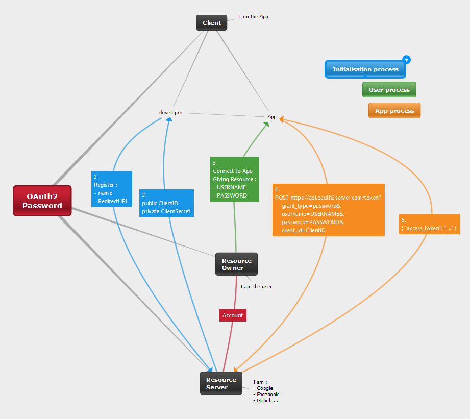
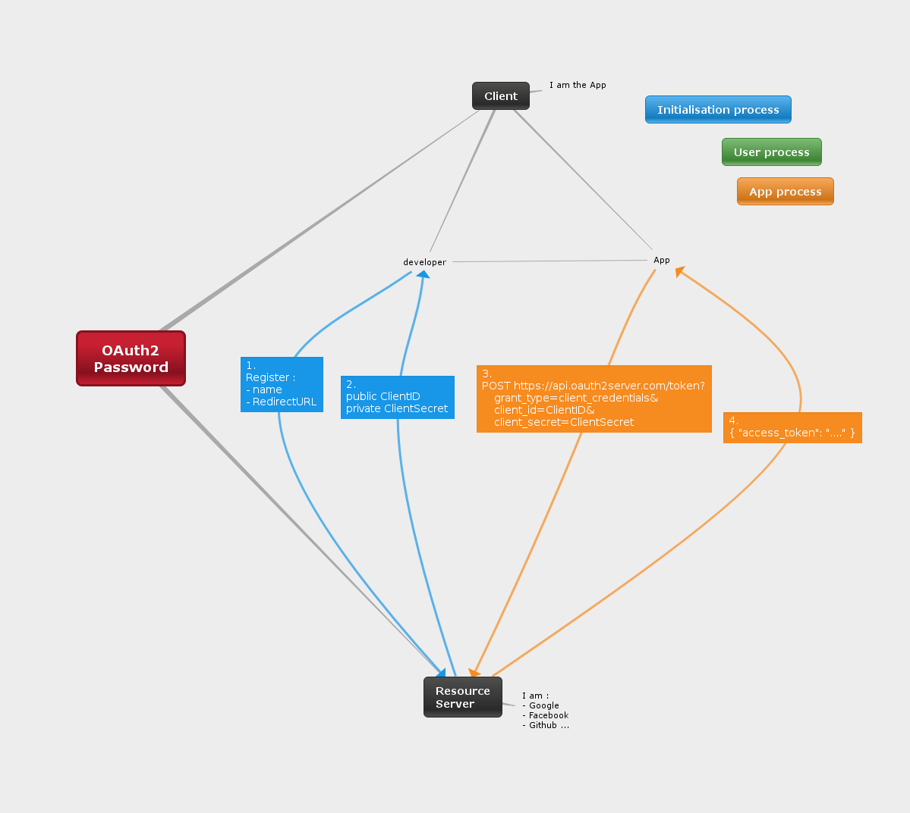

# OAuth2 process

From [this](https://aaronparecki.com/articles/2012/07/29/1/oauth2-simplified) tutorial

---
## Web Server App


```bash
4.
https://oauth2server.com/auth?
        response_type=code&
        client_id=CLIENT_ID&
        redirect_uri=REDIRECT_URI&
        scope=photos

5.
https://oauth2client.com/cb?code=AUTH_CODE_HERE

6.
POST https://api.oauth2server.com/token?
    grant_type=authorization_code&
    code=AUTH_CODE_HERE&
    redirect_uri=REDIRECT_URI&
    client_id=CLIENT_ID&
    client_secret=CLIENT_SECRET
```

---
## Browser-Based Apps


```bash
4.
https://oauth2server.com/auth?
    response_type=token&
    client_id=CLIENT_ID&
    redirect_uri=REDIRECT_URI&
    scope=photos

5.
https://oauth2client.com/cb#token=ACCESS_TOKEN

```

---
## Mobile

TODO

---
## Password


```bash
4.
POST https://api.oauth2server.com/token?
    grant_type=password&
    username=USERNAME&
    password=PASSWORD&
    client_id=CLIENT_ID

```

---
## Application access


```bash
3.
POST https://api.oauth2server.com/token?
    grant_type=client_credentials&
    client_id=CLIENT_ID&
    client_secret=CLIENT_SECRET
```

## Making an authenticated request
```bash
curl -H "Authorization: Bearer TOKEN" https://api.oauth2server.com/1/me
```
