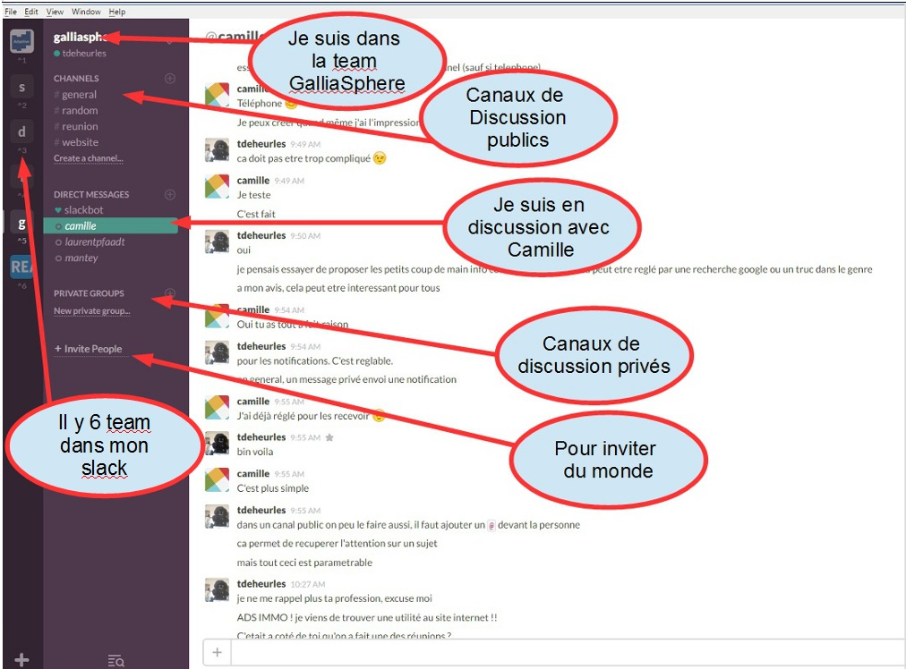
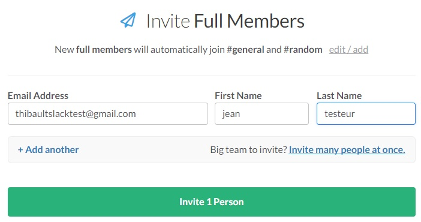
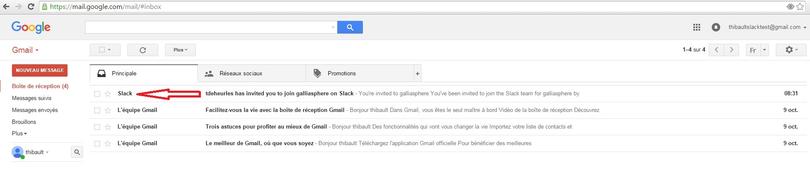
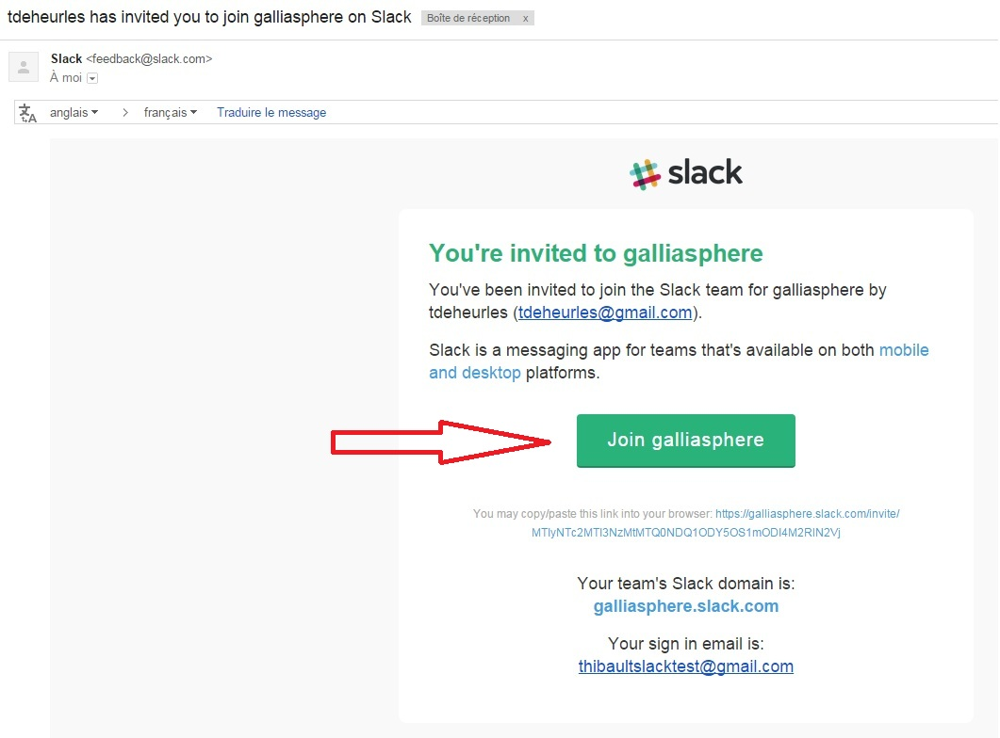
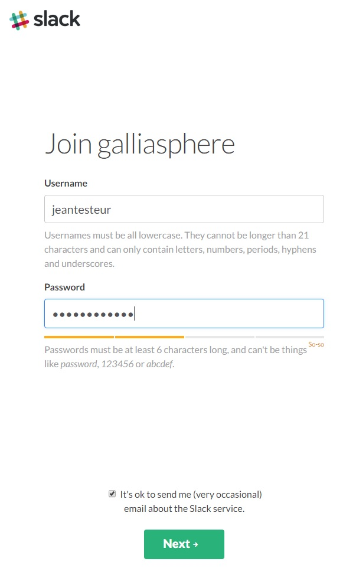
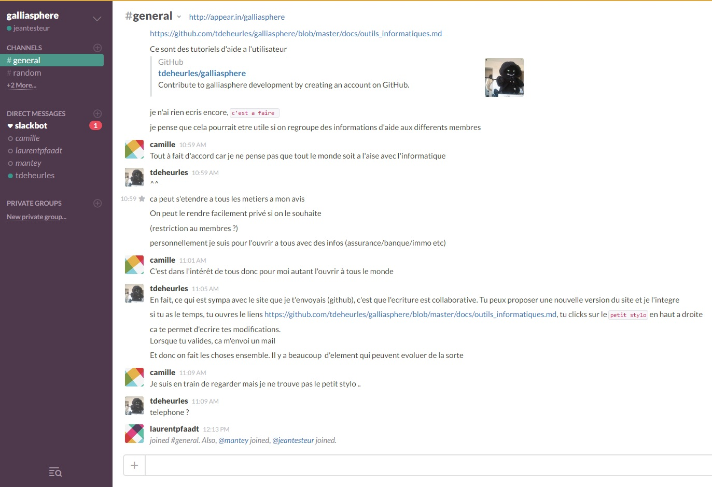
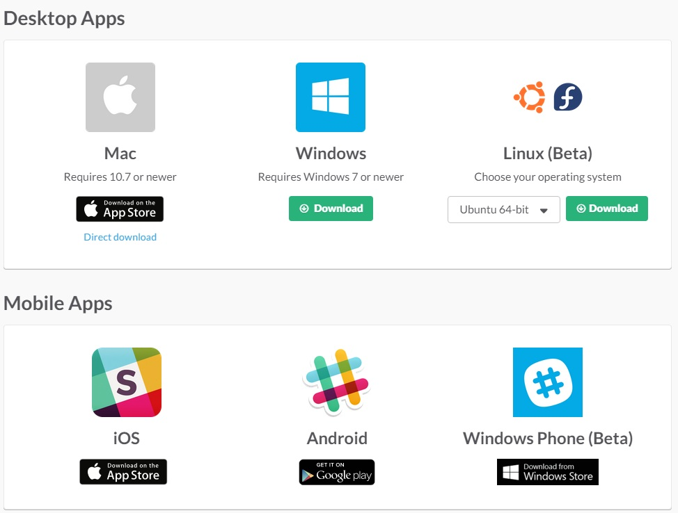

# Tutoriel Slack

Ce tuto est a destination des personnes ayant des difficultés a rejoindre `Slack`.  
N'hésitez pas a envoyer vos commentaires a tdeheurles@gmail.com.

---

### Pourquoi Slack

Slack est un moyen de communication. Il permet d'avoir des discussions a la maniere des `sms`. Le plus est que nous pouvons discutez a plusieurs sur une meme conversation.

Vous pouvez par exemple voir dans l'image 1 ci-dessous que je suis en conversation avec Camille et que je discute avec elle dans la `team` galliasphere.

##### image 1  

Vous pouvez voir aussi que j'ai plusieurs team (les carrés sur la gauche), ce sont différents projets sur les lesquels je travail et me permettent de discuter avec les clients.

---

### Comment on rejoint

Le but de ce papier est de simplifier les démarches pour rejoindre la team `galliasphere`. J'ai créé un compte gmail vierge avec lequel je vais rejoindre la team galliasphere a titre d'exemple.

Tout commence par l'invitation d'une personne depuis `slack`. Vous pouvez voir dans l'image 2 ci-dessous que j'invite Mr `jean testeur` ayant le mail `thibaultslacktest@gmail.com`

##### image 2  

Lorsque je clic sur `Invite 1 person`, Mr `jean testeur` recoit un mail a l'adresse `thibaultslacktest@gmail.com`. Voir ci-dessous dans l'image 3 et 4 :

##### image 3    

##### image 4  

Je clic sur le bouton `join galliasphere` (qui s'ignifie `rejoindre gallaisphere` ;-) et je suis redirigé vers mon browser (internet explorer ou firefox ou chrome ou ...). Je me retourve alors a devoir choisir un nom d'utilisateur et un mot de passe comme vous pouvez le voir dans l'image 5 :

##### image 5  

Ici, noté bien que :

#### Username
Il est écrit : le nom utilisateur (username) doit etre écrit en **caractere minuscule**, il ne doit **pas faire plus de 21 lettres**. Et il ne peut comporté que certains caracteres speciaux (comme le `_`). 
**Faites simple et ne mettez que votre prenom ou votre prenom nom** (En mettant absolument le `pré`nom avant le nom sinon il y a quelqu'un qui risque de raller ;-) !

#### Password

Le mot de passe doit au moins faire 6 lettres ou chiffres. La barre de couleur montre la qualité de votre mot de passe. **Notez que les mot de passe simpliste peuvent etre refusé !!**

Enfin on click sur Next (apres avoir décoché les pubs si vous n'en voulez pas).

Si tout ce passe normalement on se retrouve sur une page web (dans internet explorer ou firefox ou chrome ou ...) tel que celle de l'image 6.

##### image 6  

Enfin, noté que pour rejoindre a nouveau la team galliasphere sur slack, il faudra aller de nouveau a l'adresse suivante [`https://galliasphere.slack.com`](https://galliasphere.slack.com).

### Application

Noté qu'il y a également des applications slack pour les plateformes Windows, Linux, MacOSX, Android, iPhone et Windows phone. Vous pourrez les trouver a l'adresse suivante : [`https://slack.com/apps`](https://slack.com/apps) en clickant sur le bouton qui correspond a votre plateforme.

